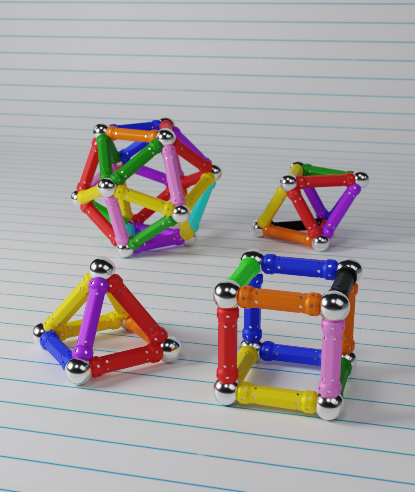
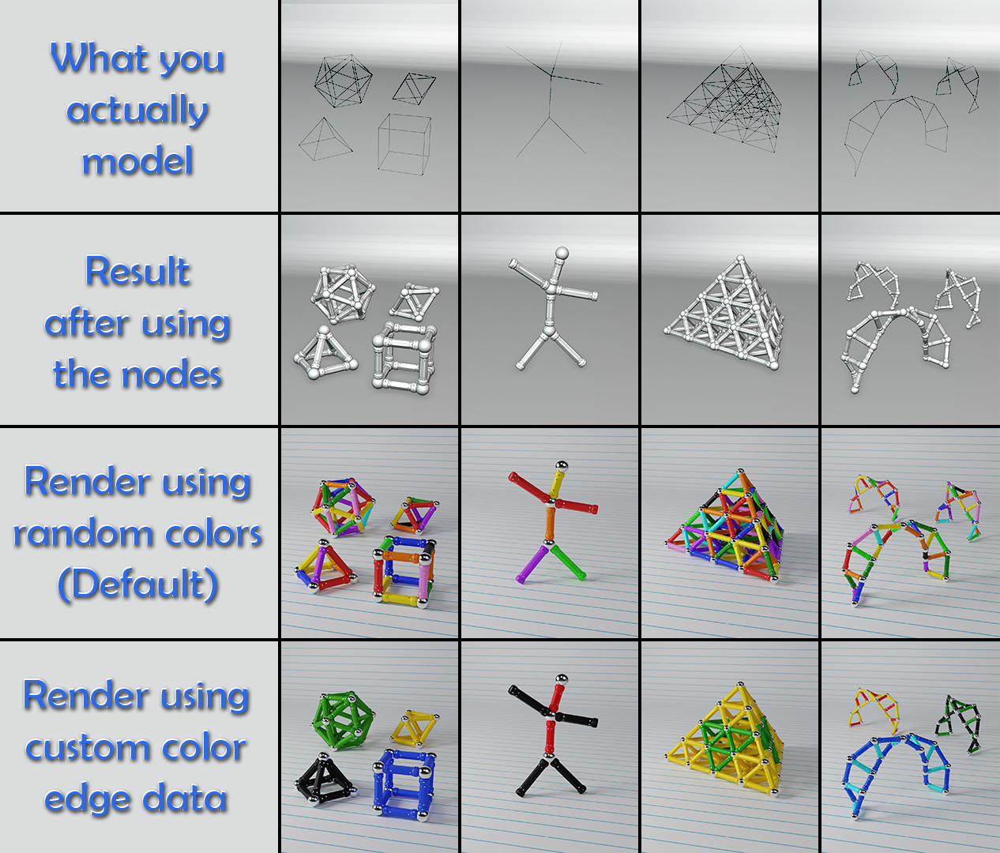
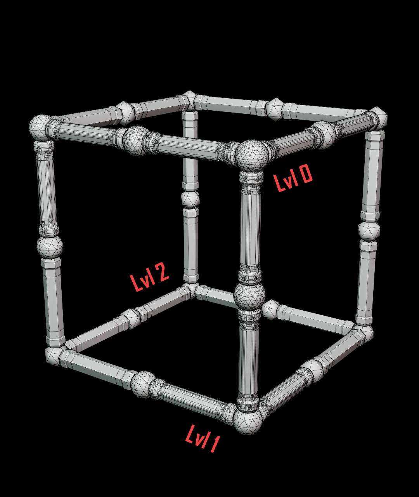
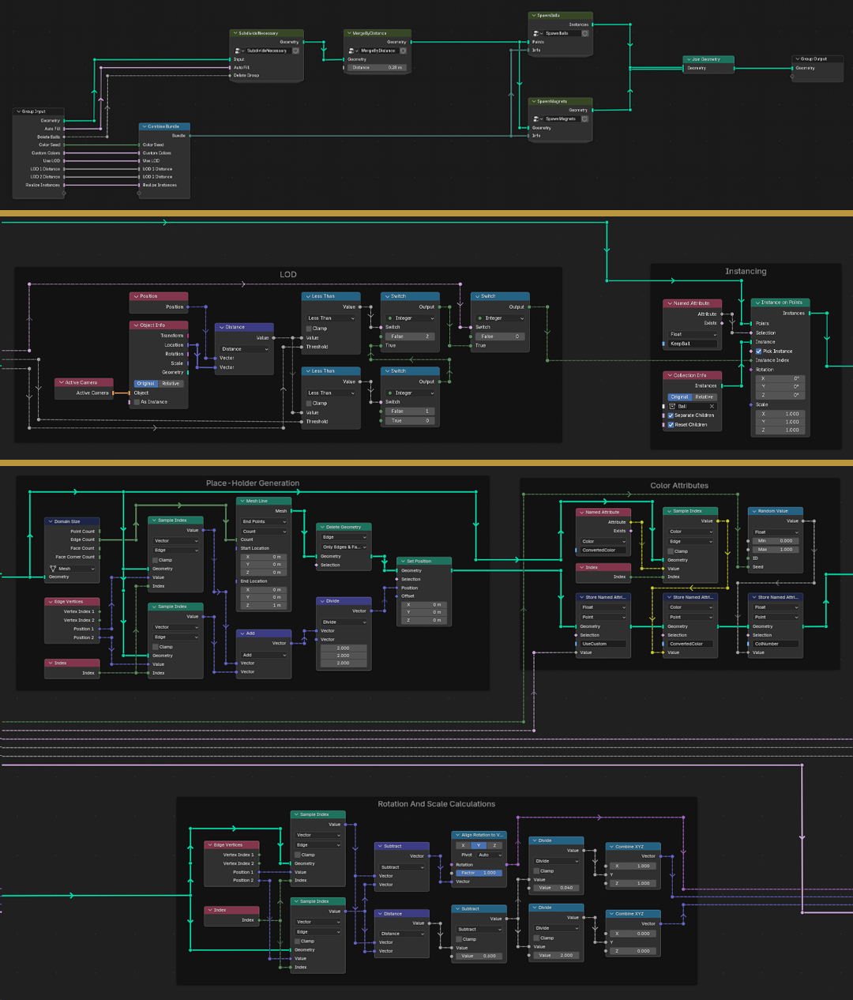

# Magna-Build

**Magna-Build** is a Blender 5.0 Geometry Nodes system that instantly transforms any 3D mesh into magnetic toy structures. Spawn metal balls at vertices and create magnetic sticks along edges — fully customizable, highly optimized, and completely free to use.

---

## Features

* **Automatic filling of long edges** with balls and magnetic sticks (optional)
* **Vertex group exclusion** to prevent balls from spawning on certain vertices (optional)
* **Random color seed** for magnetic sticks (optional)
* **Custom stick colors**: assign custom colors to sticks using a mesh attribute called `"CustomColor"` (Edge domain, Color type).
* **3-level LOD system** for faster rendering of instances based on camera distance (optional; adjustable distances)
* **Instance realization** for exporting to other engines/environments
* **Single global custom shader** for all settings, for simplicity and ease of use
* **Highly optimized calculations** to reduce per-frame render times, even for complex meshes
* **Clean, organized nodes**: all nodes are properly grouped, titled, and segmented for readability and easy editing

---

## How to Use

1. **Open the .blend file** in Blender 5.0 or higher

2. **Select any mesh** you want to test

3. In the **Geometry Nodes Properties**, you can:

   * Enable automatic edge filling
   * Assign a **vertex group** to prevent balls from spawning
   * Adjust **random color seed**
   * Enable **custom stick colors**

     * Add an attribute called `"CustomColor"` to the mesh
     * Set Domain to `Edge` and Type to `Color`
     * Assign desired colors to edges manually (default is white)
   * Enable LOD system and set distances
   * Enable **instance realization** if you want to export

4. **Preview your magnetic toy structures** in real-time

5. **Use this Geometry Nodes system** freely in all your Blender projects

> The Geometry Nodes setup is highly readable and well-organized, making it easy to navigate, tweak, or extend.

---

## Installation / Download

* Clone the repository or download the `.blend` file directly:

* Open `Magna-Build.blend` in Blender 5.0 or higher

---

## License

**CC0** — Magna-Build is completely free to use, modify, and distribute however you like.

---

## Screenshots & Docs

